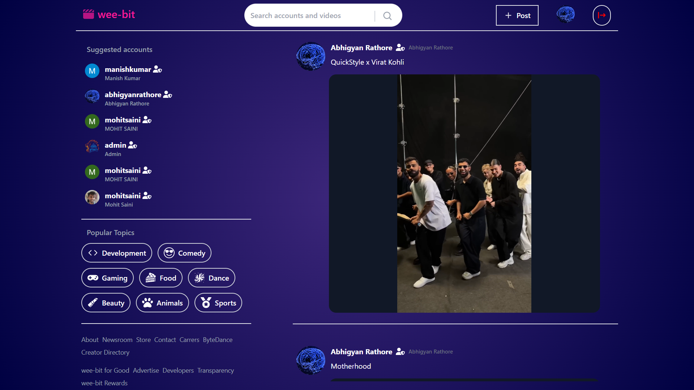

# Wee-Bit

Wee-Bit is a short video content platform where users can upload, share, and watch videos under 1 minute. It aims to provide a quick and easy way for users to share their experiences, ideas, and creativity with others.

## Features

* Upload short videos
* Browse and watch videos uploaded by other users
* Like, comment, and share videos with others
* Follow other users and see their latest uploads
* Search for videos based on keywords or hashtags
* Download your favourite videos

## Technologies Used

* Next.js for the frontend
* Sanity.io for the backend and Database Management
* Replit for deployment

## Installation

* Clone the repository
* Install dependencies using npm install --legacy-peer-deps
* Set up environment variables for the Sanity.io and Google Auth Client ID in .env.development file
* Run the server using npm run dev
* Open the app in your browser at http://localhost:3000